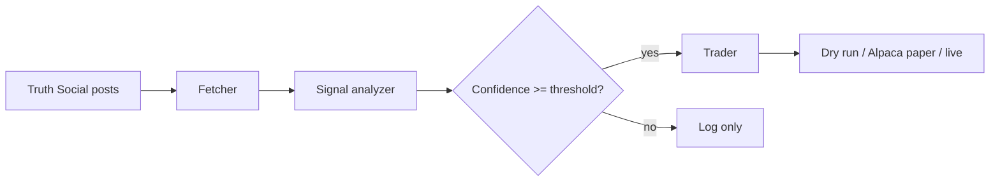

# Sunshine

A Python trading bot that monitors Donald Trump's Truth Social posts, classifies them against a market playbook, and executes trades (dry-run by default).

**Disclaimer:** This is experimental software for research and paper trading. It is not financial advice. Markets react unpredictably; past keyword patterns do not guarantee future returns.

## How it works



1. **Fetch** — Polls new posts from CNN's public [Truth Social archive](https://ix.cnn.io/data/truth-social/truth_archive.json) (updated ~every 5 minutes). Optional direct Truth Social API via `curl_cffi`.
2. **Analyze** — Matches posts against configurable keyword playbooks (tariffs, Fed, crypto, defense, energy) and extracts `$TICKER` mentions.
3. **Trade** — Logs simulated orders in dry-run mode, or sends notional market orders via [Alpaca](https://alpaca.markets/) in paper/live mode.

## Quick start

```bash
cd sunshine
python -m venv .venv
source .venv/bin/activate
pip install -e .

cp .env.example .env
# Edit .env if using Alpaca or Anthropic

# One-shot poll (dry run)
sunshine poll

# Continuous monitor
sunshine monitor

# Analyze recent posts without trading
sunshine analyze --limit 5

# Test a hypothetical post
sunshine analyze --text "We will impose 25% tariffs on China imports effective immediately"

# Check status
sunshine status
```

## Configuration

| File | Purpose |
|------|---------|
| `config.yaml` | Playbook keywords, tickers, fetcher settings, confidence threshold |
| `.env` | API keys, trading mode, poll interval |

### Trading modes

| Mode | Behavior |
|------|----------|
| `dry_run` (default) | Log trades to SQLite, no broker connection |
| `paper` | Alpaca paper trading (`ALPACA_PAPER=true`) |
| `live` | Real Alpaca orders — use with extreme caution |

Set `TRADING_MODE=paper` and add Alpaca keys to `.env` for paper trading.

### Optional LLM enrichment

Set `ANTHROPIC_API_KEY` to refine confidence scores with Claude. Keyword rules still drive ticker selection.

## Playbook categories

Configured in `config.yaml`:

- **tariff_escalation** — Long steel (NUE, X), short SPY / China ADRs on tariff language
- **fed_criticism** — Short SPY/QQQ, long GLD on Fed/rate criticism
- **crypto_positive** — Long COIN, MSTR, IBIT
- **defense** — Long LMT, RTX, NOC
- **energy** — Long XLE, XOM, CVX

Edit keywords and tickers to match your thesis. Posts mentioning `$AAPL` etc. trigger direct ticker buys.

## Project layout

```
sunshine/
├── config.yaml          # Playbook + settings
├── sunshine/
│   ├── fetcher.py       # CNN archive + Truth Social API
│   ├── analyzer.py      # Keyword + optional LLM signals
│   ├── trader.py        # Dry-run and Alpaca execution
│   ├── storage.py       # SQLite persistence
│   ├── bot.py           # Main loop
│   └── cli.py           # CLI entry point
└── data/sunshine.db     # Created at runtime
```

## Rate limits

Direct Truth Social API calls are rate-limited and Cloudflare-protected. The default CNN archive fetcher avoids this. To try direct API, set `fetcher.primary: truth_social` in `config.yaml` and ensure `curl_cffi` is installed.

## License

MIT
